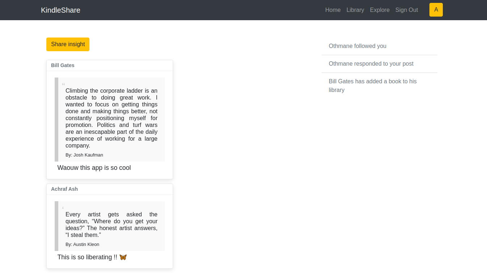
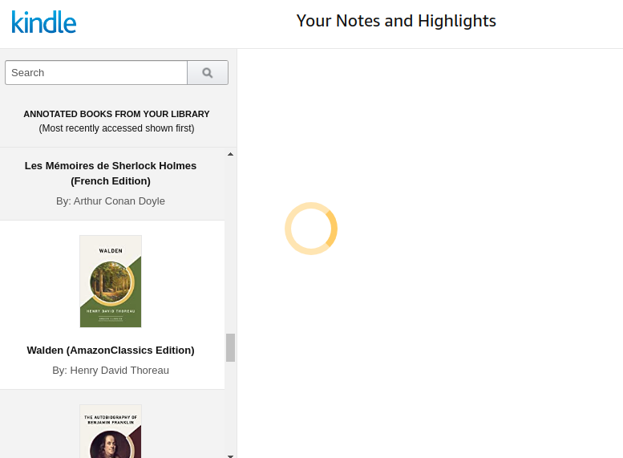
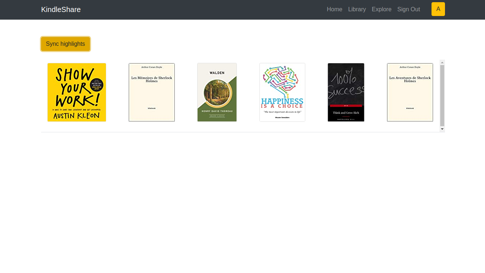
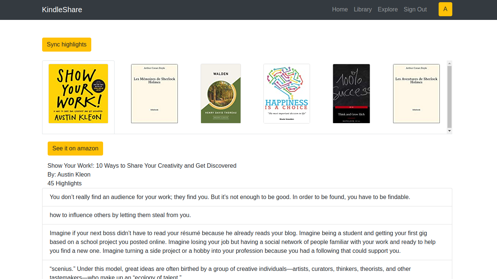
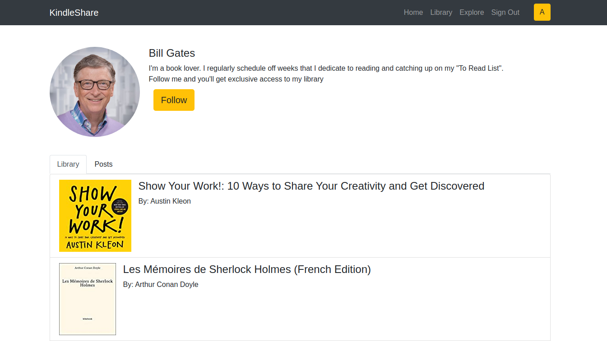
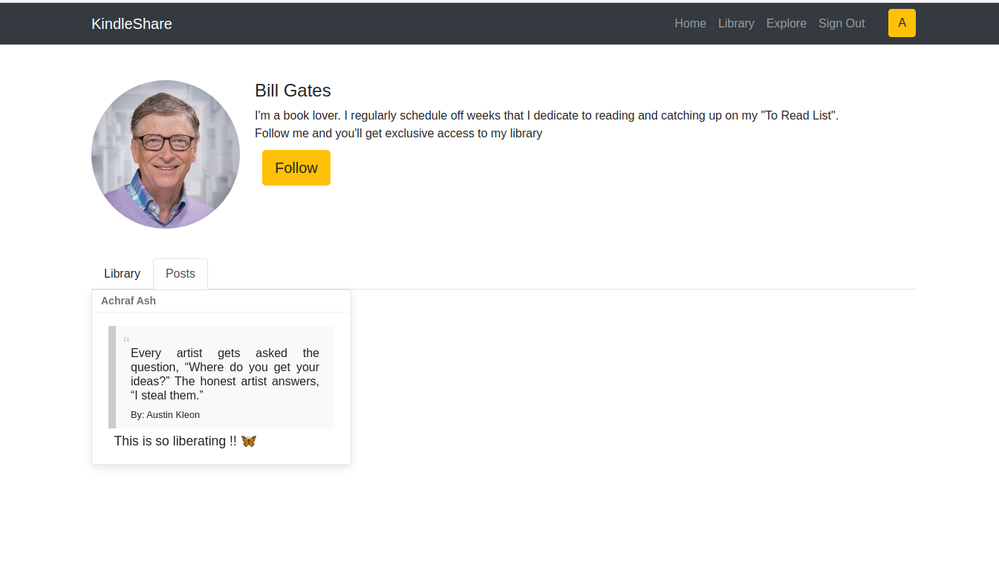

# KindleShare

## What is ?

A web application to browse your Kindle highlights, share them, and explore the libraries of inspiring people.

It's a prototype of an idea I had. It was also an opportunity to learn Bootstrap and Redux.

## Tech

- React + Redux
- Puppeteer (scrapping highlights)
- Bootstrap
- MongoDB (cloud)

## Problem

Unfortunately, I've ran into a problem to which I haven't found a solution to this day.

- Amazon doesn't have a proper API to fetch Kindle highlights,
- I can't use "Login With Amazon" because highlights are on an other platform
- I can't run the scrapper on headless mode, but in production, puppeteer can not create an instance of a browser

So the main feature, which is retrieving your Kindle highlights, doesn't work in production.

I've made the mistake of working on it for weeks, adding new features, only to realise later, once deployed, that it doesn't work.
**Lesson learned.**

##Preview
**Share highlights:**

**Retrieve your books and highlights**

**Browse your library:**

**Profile:**

